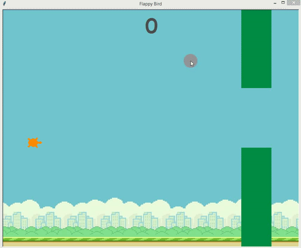

# Flappy Turtle Game

Welcome to Flappy Turtle Game!. This project was born out of my passion for game development and my desire to create a fun.

## Features

- Minimalistic Graphics
- Not responsive 
- Moving Obstacles
- Scoring System
- Game Over Screen
- Full 2D Controls (Arrow Keys)

## Technologies Used

- Python
- Turtle (module)
- OOP

## Getting Started

- To view the website, simply run the `python main.py` command in your terminal.

## Demo

## Contact

If you have any questions or comments, feel free to contact me at alibek.mukhammadiev@gmail.com
